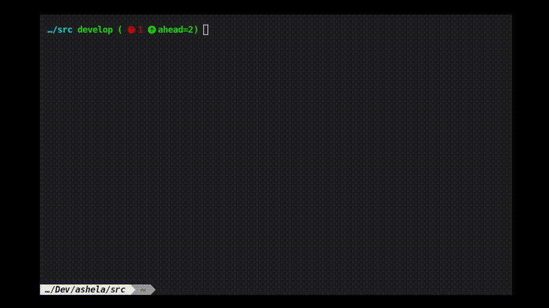

# Curren State

# ✅ Unix Shell Feature List

### ✔️ Completed Features
- [x] Prompt display (e.g., `mysh>`)
- [x] Tokenizer via `strtok()`
- [x] Reading user input (line-based)
- [x] Basic system fetch-info(`fetchbox()`)
- [x] Built-in commands (e.g., `pwd` , `cd` , `touch` ,`ls`,`cd`)
### 🛠️ In Progress
- [ ] Organizing the project structure
- [ ] Command history (possibly saved in a `.history` file)
### Planned Features
- [ ] $PATH environment
- [ ] Input/output redirection (`>`, `>>`, `<`)
- [ ] Pipe support (`|`)
- [ ] Background process support (`&`)
- [ ] Tab completion (optional, via `readline` or similar)
- [ ] AST (Abstract Syntax Tree) creation and evaluation
- [ ] Subshell support using parentheses `()`
- [ ] Script support( existing languages or newly created ) 

